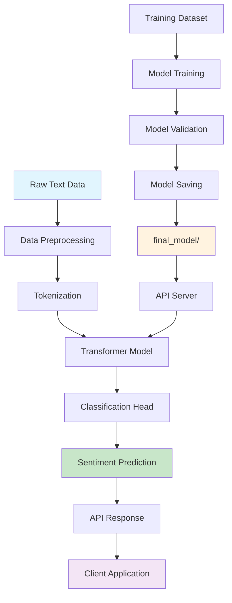

# Multipurpose Sentiment Analysis

<div align="center">


*A production-grade sentiment analysis toolkit powered by state-of-the-art transformers*

[Features](#-features) •
[Quick Start](#-quick-start) •
[API Usage](#-api-usage) •
[Applications](#-real-world-applications) •
[Documentation](#-documentation)

</div>

##  Project Overview

**Multipurpose Sentiment Analysis** is an end-to-end sentiment analysis solution built with HuggingFace Transformers. Designed for both experimentation and production deployment, it offers robust sentiment classification capabilities with a clean, extensible architecture.

The toolkit supports custom model training, fine-tuning, and provides a RESTful API for seamless integration into existing applications.

##  Features

- ** State-of-the-Art Models**: Leverage BERT, DistilBERT, and other transformer architectures
- ** Production-Ready API**: FastAPI server with real-time inference capabilities  
- ** Custom Training Pipeline**: Modular training and fine-tuning on your datasets
- ** Flexible Classification**: Support for binary, multiclass, and custom sentiment labels
- ** Easy Deployment**: Streamlined setup with comprehensive documentation
- ** Extensible Architecture**: Simple model swapping and preprocessing customization

##  Repository Structure

```
Multipurpose-Sentiment-Analysis/
├── main.py              # Core training and evaluation pipeline
├── api_server.py        # REST API server for inference
├── final_model/         # Trained model artifacts and checkpoints
├── requirements.txt     # Python dependencies
├── .gitignore          # Git ignore patterns
└── .gitattributes      # Git LFS configuration
```

## Quick Start

### Prerequisites

- Python 3.7 or higher
- CUDA-compatible GPU (optional, for faster training)

### Installation

```bash
# Clone the repository
git clone https://github.com/SIDDHARTH-PADIGAR/Multipurpose-Sentiment-Analysis.git
cd Multipurpose-Sentiment-Analysis

# Install dependencies
pip install -r requirements.txt
```

### Training Your Model

Configure your dataset and hyperparameters in `main.py`, then start training:

```bash
python main.py
```

### Launch the API Server

```bash
python api_server.py
```

The API will be available at `http://localhost:8000` with interactive documentation at `/docs`.

## API Usage

### Basic Sentiment Analysis


## Real-World Applications

### E-commerce & Product Analytics
- **Review Monitoring**: Automatically analyze thousands of customer reviews to gauge product sentiment
- **Purchase Intelligence**: Help customers make informed decisions with real-time sentiment summaries
- **Brand Management**: Track sentiment trends across products and identify areas for improvement

### Business Intelligence
- **Customer Feedback Analysis**: Process support tickets and feedback forms for sentiment insights
- **Social Media Monitoring**: Analyze brand mentions and customer conversations
- **Content Optimization**: Evaluate marketing content sentiment before publication

## Workflow Architecture



## ⚙️ Customization

### Switching Models

```python
# In main.py or api_server.py
from transformers import AutoTokenizer, AutoModelForSequenceClassification

# Change model architecture
model_name = "distilbert-base-uncased"  # or "roberta-base", "albert-base-v2"
tokenizer = AutoTokenizer.from_pretrained(model_name)
model = AutoModelForSequenceClassification.from_pretrained(model_name)
```

### Custom Dataset Training

```python
# Adapt your data format in main.py
def load_custom_dataset():
    # Your custom data loading logic
    return train_texts, train_labels, val_texts, val_labels
```

### Extending Beyond Sentiment

The architecture supports various text classification tasks:
- Emotion detection (joy, anger, fear, etc.)
- Topic classification
- Spam detection
- Intent recognition

## Performance & Evaluation

The toolkit provides comprehensive evaluation metrics:
- **Accuracy**: Overall prediction correctness
- **Precision**: True positive rate per class
- **Recall**: Sensitivity per class  
- **F1-Score**: Harmonic mean of precision and recall
- **Confusion Matrix**: Detailed classification breakdown

Results are logged and saved for model comparison and performance tracking.

## Development

### Contributing

1. Fork the repository
2. Create your feature branch (`git checkout -b feature/amazing-feature`)
3. Commit your changes (`git commit -m 'Add amazing feature'`)
4. Push to the branch (`git push origin feature/amazing-feature`)
5. Open a Pull Request

## About the Author

**Siddharth Padigar**  
[](https://github.com/SIDDHARTH-PADIGAR)  

Built as a portfolio-quality, production-grade project showcasing modern NLP and transformer technologies.

## Support

- 📫 **Issues**: [GitHub Issues](https://github.com/SIDDHARTH-PADIGAR/Multipurpose-Sentiment-Analysis/issues)
- 💬 **Discussions**: [GitHub Discussions](https://github.com/SIDDHARTH-PADIGAR/Multipurpose-Sentiment-Analysis/discussions)
- ⭐ **Star this repo** if you find it helpful!

---

<div align="center">
Made with ❤️ by <a href="https://github.com/SIDDHARTH-PADIGAR">Siddharth Padigar</a>
</div>
